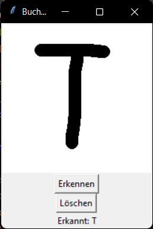

# Buchstabenerkennung mit Künstlicher Intelligenz

Dieses Projekt erkennt handgeschriebene Großbuchstaben (A-Z) mit Hilfe eines trainierten neuronalen Netzes. Die Benutzeroberfläche ermöglicht es, direkt Buchstaben einzuzeichnen und automatisch erkennen zu lassen.

## 🔧 Installation & Vorbereitung

### Voraussetzungen

- Python 3.12.7
- Empfohlene Pakete (installierbar mit `pip`):
  ```bash
  pip install tensorflow numpy pillow opencv-python scikit-learn
  ```

### Daten vorbereiten

1. Lege deinen Datensatz im Ordner `BigDataSet` ab, strukturiert nach Buchstaben (z. B. `BigDataSet/A`, `BigDataSet/B`, …).
2. Erstelle die `.npy`-Dateien für das Training:
   ```bash
   python npy_creator.py
   ```

### Modell trainieren

Führe das Trainingsskript aus, um das Modell zu trainieren und als `.keras`-Datei zu speichern:
```bash
python model_trainer.py
```

### GUI starten

Starte die grafische Benutzeroberfläche:
```bash
python Tkinter_GUI.py
```

## 🖼️ Screenshots

### Beispielhafte Anwendung der GUI



## 📁 Projektstruktur

```text
.
├── BigDataSet/                  # Ordner mit sortierten Buchstabenbildern (PNG)
├── npy_creator.py               # Erstellt .npy-Dateien für Training
├── model_trainer.py             # Trainiert das Modell und speichert es
├── trained_handwriting_model.keras # Trainiertes Modell (Output)
├── Letter_Testing.py            # Manuelle Test-Ausgabe zur Modellprüfung
├── Tkinter_GUI.py               # GUI zur Buchstabenerkennung
└── image.png                    # Screenshot der GUI
```

## 📌 Hinweise

- Die Bilder müssen schwarz-auf-weiß sein (weißer Hintergrund, schwarze Schrift).
- Das Modell erwartet Bilder mit 28x28 Pixeln.
- Die GUI zeigt die Vorhersage des eingezeichneten Buchstabens in Echtzeit nach dem Klick auf „Erkennen“.

---

(c) Thomas Ortner, written by ChatGPT
```
